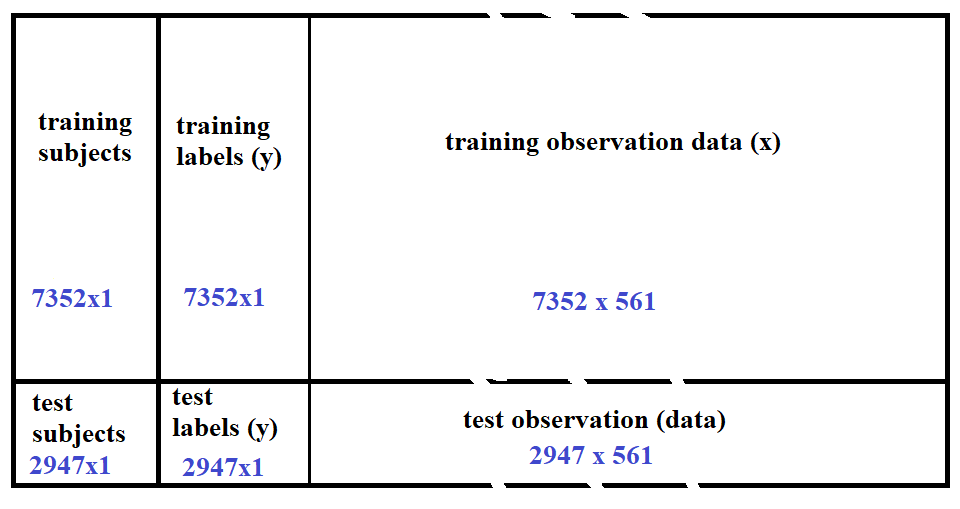

## Files included in this repository.

| File                 | Description                                                                                   |
|----------------------|-----------------------------------------------------------------------------------------------|
| readme.md            | This file.                                                                                    |   
| run_analysis.R       | The file responsible for merging and tidying up the dataset and running the desired analysis  |      
| tidy_tall.csv        | tall tidy data before analysis.                                                               |     
| analysis_tall.csv    | final analyzed dataset summary.                                                               |
| cookbook.md          | Description of data in the final dataset.                                                     |


The provided csv were written from our tidyed up data in the following manner: 
```
write.csv(data_tall,'tidy_tall.csv',row.names=FALSE)
write.csv(final_data_tall,'analysis_tall.csv',row.names=FALSE)
```
and can be read using read.csv('filename.csv') with no other parameters.


## Project Description

The purpose of this project is to demonstrate our ability to collect, work with, and clean a data set. The goal is to prepare tidy data that can be used for analysis. 

To demostrate this. this, we will utilize the dataset provided by UCI [http://archive.ics.uci.edu/dataset/240/human+activity+recognition+using+smartphones](http://archive.ics.uci.edu/dataset/240/human+activity+recognition+using+smartphones) 

The link to the version of the dataset used for this analysis is:
[https://d396qusza40orc.cloudfront.net/getdata%2Fprojectfiles%2FUCI%20HAR%20Dataset.zip](https://d396qusza40orc.cloudfront.net/getdata%2Fprojectfiles%2FUCI%20HAR%20Dataset.zip)

These files are not included in this repository due to size restrictions. If downloading these manually to recreate this project, the files should be unzipped into your project root.

This dataset(s) contains data from the following experiment

*  a group of 30 volunteers (subjects) performed a variety of tasks while data was recorded
  + Each of the volunteers wore a smart phone device capable of taking accelerometer and gyroscopic data.
  + Each volunteer performed a variety of activities (Walking, Walking upstairs, walking downstairs, sitting, standing, and laying)
  
Upon reading the provided readme.txt file that accompanied this data, we see that the data spans across 6 files ()

| File                        | Description                                                                        | 
|-----------------------------|------------------------------------------------------------------------------------|
| test\\subject_test.txt      |   Contains labels for each participant in the test data                            |
| test\\y_test.txt            |   Contains labels for each activity performed in the test data.                    |
| test\\x_test.txt            |   Contains the Accelerometer and Gyroscope measurements for the test data          |
| training\\subject_test.txt  |  Contains labels for each participant in the test data                             |
| training\\y_test.txt        |     Contains labels for each activity performed in the test data.                  |
| training\\x_test.txt        |    Contains the Accelerometer and Gyroscope measurements for the test data         |


Also accompanying this data were the following informative text files that were instrumental in understanding the 
underlying structure of the data.


| File                    | Description                                                                        | 
|-------------------------|------------------------------------------------------------------------------------|
| readme.txt              | this filed details what many of the included files are.                            |
| features.txt            | list of the 561 measurements measured in the experiment                            |
| features_info.txt       | some detailed information about what and how the measurements were collected       |
| activities_labels.txt   | file explaining how each activity is enumerated (assigned a value 1-6)             |


It should be noted that this dataset is split into testing and training data as it was used for to classify
activities based on accelerometer and gyroscopic data.  In practice the training data would have labels that would be used
to train the classifier, while the test data labels would be used to verify the validity and performance of the classifier.

Since this is not our intention in this project, We will combine all this data into a single dataframe for analysis.  This means that training data and test data (subjects, labels and features.) will need to be merged.

Once merged, our goal will be to tidy up the data set by transforming the dataset and providing meaningful column names.  Lastly we will subset the data to focus on mean and sd measurements from the experiment.  We will analyze this data by calculating the mean of each relevant measurement.


## Carrying out the project


First, looking at the data and provided readme, we will construct the data from the files as follows




### run_analysis.R details

To aid in the analysis of the overall data, we will make use of the dplyr and tidyr libraries.  


```
library(dplyr)
library(tidyr)
```


Looking at the data, we see that the Activity column (based on *_y.txt) is enumerated 1-6.  Since we want this to clearly indicate the activity, we will read in the appropriate labels from activity_labels.txt.  Also since we wish to label our columns, we will also read in the labels provided by feature.txt which give a detailed name for each of the 561 measurments.
```
activity_labels <- read.table('UCI HAR Dataset\\activity_labels.txt')
feature_labels <- read.table('UCI HAR Dataset\\features.txt')
```

Additionally, we search the features for the mean() and sd() measurements as specified in the project description.  This will be used in the final subsetting of the data to isolate only mean and sd measurements.  Note: we omit measurements that were calculated from means or sds (such as the angle measurements).  If these are desirable they may be obtained by altering the first grep pattern to '(M|m)ean'   

```
desired_features <- c(grep('mean',feature_labels$V2),grep('std',feature_labels$V2))
desired_features <- sort(desired_features)
```

Next, we read in our data into 6 separate dataframes which will piece together.  This can be accomplished with read.table()
without any parameters as the data is space delimited.  We do assign a temporary name to the y data (activity labels) which will be used to assist in changing our activities from numerics to strings.
```
data_training_y <- read.table('UCI HAR Dataset\\train\\y_train.txt',col.names="y")
data_training_x <- read.table('UCI HAR Dataset\\train\\x_train.txt')
data_training_subject <- read.table('UCI HAR Dataset\\train\\subject_train.txt')
data_test_y <- read.table('UCI HAR Dataset\\test\\y_test.txt',col.names='y')
data_test_x <- read.table('UCI HAR Dataset\\test\\x_test.txt')
data_test_subject <- read.table('UCI HAR Dataset\\test\\subject_test.txt')
```

From there we begin building our dataframe, by first forming 3 dataframes:  one for subject, y and x 
```
combined_data_y <- rbind(data_training_y,data_test_y)
combined_data_x <- rbind(data_training_x,data_test_x)
combined_data_subject <-rbind(data_training_subject, data_test_subject)
```

Next we change the enumerated activity to text by using our activity_labels.

```
combined_data_y[,1] = activity_labels[combined_data_y$y,2]
```


We now form a single dataframe by combining the previous 3 dataframes columnwise
```
combined_data <- cbind(combined_data_subject,combined_data_y,combined_data_x)
```


Next, we label our columns with the help of the feature_labels. 

```
colnames(combined_data) <- c('Subject','Activity',feature_labels[,2] )
```


We now subset to only give us the subject, activity and any of the mean() and sd() measurements.  We used our
desired_features vector for this, remembering to offset it by 2 since there are 2 additional columns in our data now (the subject and the activity.)
```
data_wide <- combined_data[ ,c(1,2,desired_features+2)  ]
```

Lastly, we gather the measurement columns to form a tall tidy dataset.  In this format an observation consists of a Subject, the activity being performed, the measurement being taken and the value of that measurement.  This is the typical "tall" dataset that is exemplified in Wickman's paper on Tidying data.
```
data_tall <- pivot_longer(data_wide,c(-Subject,-Activity),names_to = "Measurement.Name", values_to = "reading")
```                          
                          
This allows for the desired averages to be calculated with ease.                          
```
final_data_tall <- data_tall %>% group_by(Subject,Activity,Measurement.Name) %>% summarize(measurement.means = mean(reading))
```


